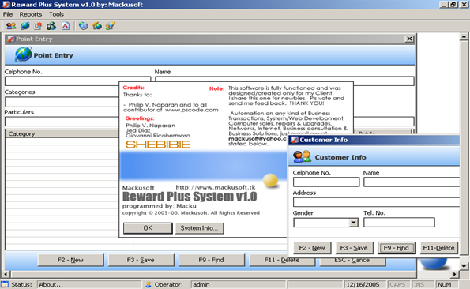



## A Reward Plus System

### Description

I share this program for others (specially newbies) to have idea on how making software. In this submission you will learn how to connect in MS Access Database using ADO and ODBC, Update/Save/Delete/Search record, open an excel file, computation, formatting, etc. just download it and have fun. Pls. vote and let me know your opinion. I highly appreciate your feedback. Thanks! :D
 
### More Info
 

             |
---                |---
**Submitted On**   |2005-12-16 14:34:04
**By**             |[Macku](https://github.com/Planet-Source-Code/PSCIndex/blob/master/ByAuthor/macku.md)
**Level**          |Beginner
**User Rating**    |4.6 (78 globes from 17 users)
**Compatibility**  |VB 3\.0, VB 4\.0 \(16\-bit\), VB 5\.0, VB 6\.0, VB Script, ASP \(Active Server Pages\) , VBA MS Access, VBA MS Excel
**Category**       |[Databases/ Data Access/ DAO/ ADO](https://github.com/Planet-Source-Code/PSCIndex/blob/master/ByCategory/databases-data-access-dao-ado__1-6.md)
**World**          |[Visual Basic](https://github.com/Planet-Source-Code/PSCIndex/blob/master/ByWorld/visual-basic.md)
**Archive File**   |[A\_Reward\_P19571712162005\.zip](https://github.com/Planet-Source-Code/macku-a-reward-plus-system__1-63681/archive/master.zip)

